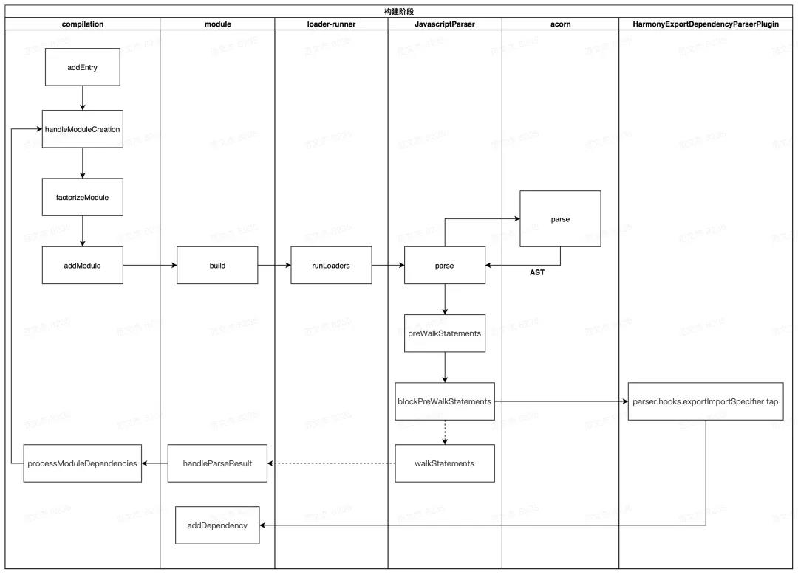

## 主要模块概念
- Entry：编译入口，webpack 编译的起点
- Compiler：编译管理器，webpack 启动后会创建 compiler 对象，该对象一直存活知道结束退出
- Compilation：单次编辑过程的管理器，比如 watch = true 时，运行过程中只有一个 compiler 但每次文件变更触发重新编译时，都会创建一个新的 compilation 对象
- Dependence：依赖对象，webpack 基于该类型记录模块间依赖关系
- Module：webpack 内部所有资源都会以“module”对象形式存在，所有关于资源的操作、转译、合并都是以 “module” 为基本单位进行的
- Chunk：编译完成准备输出时，webpack 会将 module 按特定的规则组织成一个一个的 chunk，这些 chunk 某种程度上跟最终输出一一对应
- Loader：资源内容转换器，其实就是对各种资源的预处理、加载、转译
- Plugin：webpack构建过程中，会在特定的时机广播对应的事件，插件监听这些事件，在特定时间点介入编译过程

## 构建流程

 
构建阶段从入口文件开始：

1. 调用 handleModuleCreate ，根据文件类型构建 module 子类
2. 调用 loader-runner 仓库的 runLoaders 转译 module 内容，通常是从各类资源类型转译为 JavaScript 文本
3. 调用 acorn 将 JS 文本解析为AST
4. 遍历 AST，触发各种钩子
    a. 在 HarmonyExportDependencyParserPlugin 插件监听 exportImportSpecifier 钩子，解读 JS 文本对应的资源依赖
    b. 调用 module 对象的 addDependency 将依赖对象加入到 module 依赖列表中
5. AST 遍历完毕后，调用 module.handleParseResult 处理模块依赖
6. 对于 module 新增的依赖，调用 handleModuleCreate ，控制流回到第一步
7. 所有依赖都解析完毕后，构建阶段结束

这个过程中数据流 module => ast => dependences => module ，先转 AST 再从 AST 找依赖。这就要求 loaders 处理完的最后结果必须是可以被 acorn 处理的标准 JavaScript 语法，比如说对于图片，需要从图像二进制转换成类似于 export default "data:image/png;base64,xxx" 这类 base64 格式或者 export default "http://xxx" 这类 url 格式。

compilation 按这个流程递归处理，逐步解析出每个模块的内容以及 module 依赖关系，后续就可以根据这些内容打包输出。
